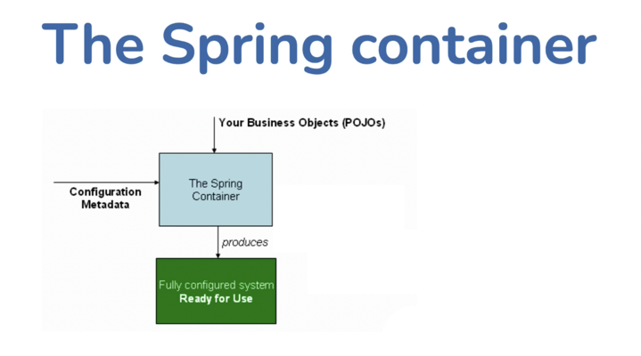

# Modern Spring from Scratch

# Table of Contents
1. [Application Frameworks](#application-frameworks)
2. [Spring](#spring)
3. [Inversion of Control (IOC) and Dependency Management](#inversion-of-control-ioc-and-dependency-management)
4. [IOC in Spring Framework](#ioc-in-spring-framework)
5. [Understanding a Spring Application](#understanding-a-spring-application)
   1. [Two types of classes in Java](#two-types-of-classes-in-java-)
   2. [Three Components of Spring Application](#three-components-of-spring-application-)
   3. [Spring's Implementation of IOC](#springs-implementation-of-ioc)
6. [Dependency Injection Variants](#dependency-injection-variants)
   1. [Dependency Injection](#dependency-injection-)
   2. [Benefits of Dependency Injection](#benefits-of-dependency-injection-)
   3. [Major Dependency Injection Variants](#major-dependency-injection-variants-)
   4. [How DI Works](#how-di-works--)
   5. [Circular Dependency](#circular-dependency-)
   6. [Constructor vs. Setter Injection](#constructor-vs-setter-injection-)
   7. [Field Injection](#field-injection--)
7. [Specifying Dependencies in Spring App](#specifying-dependencies-in-spring-app)
   1. [Benefits of Java Config](#benefits-of-java-config-)
8. [Default Behavior of Beans](#default-behavior-of-beans)
   1. [Eager](#eager--)
   2. [Singleton](#singleton--)
9. [Other Scopes : (Specifically : Web Scopes)](#other-scopes--specifically--web-scopes)
10. [Autowiring](#autowiring)
11. [Order of Spring Beans Initializations](#order-of-spring-beans-initializations)
12. [Spring Bean Life Cycle](#spring-bean-life-cycle)
    1. [@PostConstruct](#postcontruct--)
    2. [@PreDestroy](#predestroy--)


## Application Frameworks

- It's a software platform, not a library : It runs the entire project and calls our code whenever required unlike a library which we call when we need to use it's functionality
- Provides a structured environment and supports consistent environment/development standards
- Helps build and run applications by handling common tasks and provides pre-built components, libraries and tools which we can use

## Spring

- World's most popular Java application framework
- Includes:
  - core framework
  - family of frameworks and libraries : (few examples: )
    - Spring Core (Spring foundation)
    - Spring Boot (starting point to build Spring applications)
    - Spring MVC (to build web applications)
    - Spring Data (to handle data)
    - Spring Security (for authorisation and authentication)
    - Spring Integration (for integrating with other services)
    - Spring Cloud (deploying to cloud services)
    - Spring Batch (for batch operations - data processing operations, etc. which are not required suddenly; example: processing some data daily over midnight)
  - solutions for common concerns
- Spring is modular : we can plug and use only those framework family member which we need
- Since spring has so many modules that can be plugged, Spring Boot was designed which provides opinionated starting points - the common starting points, but we can also tweak them based on our needs
- Spring Offers:
  - Simplified Configuration (annotations and Java based)
  - Dependency Management (Inversion of Control (IOC) - handles lifecycle and configuration of application objects and simplified dependency management)
  - Data Access (provides JDBC template for boilerplate code and integrates with Hibernate and JPA for ORM)
  - Transactions (provides declarative transaction management feature to avoid manual transactions in code)
  - Integration (to integrate with REST, JMS, etc. with Spring APIs)
  - Security (to handle authentication and authorization)
  - Testing (for both unit testing and integration testing)
  - Microservices (build and manage configurations across multiple services, implement service discovery, etc.)

## Inversion of Control (IOC) and Dependency Management

- Traditional Control Flow : objects manage (control) their dependencies directly
  - Issues:
    - Tight Coupling
    - Lack of flexibility (in below example, we are bound to call `PaymentService` - we cannot update it to some other class, if required)
    - Maintenance challenges
    - Testing challenges (we are bound to create an instance of `PaymentService` if we need to test `OrderService`)

```java
public class PaymentService {
    public void processPayment() {
        // some code
    }
}
public class OrderService {
    PaymentService paymentService;
    
    public OrderService() {
        paymentService = new PaymentService();
    }
    
    public void makePayment() {
        paymentService.processPayment();
    }
}
```

- Two ways to fix issues of traditional control flow:
  - Service locator pattern : The class asks a service locator/coordinator for the dependency instance : If it is in production, etc. coordinator provides a new instance of the class, else if it's testing environment, it provides a mock instance of the class
  - IOC : An external entity (in our case, Spring) handles the dependencies, instead of objects themselves and thus, the control flow gets "inverted"
    - Analogy of electronic chip : A chip which performs simple calculations like addition, etc. is connected to a breadboard/circuit - it does not handle the input numbers itself but instead mentions the circuit board that it needs two inputs and then performs the calculations based on the inputs provided by the circuit board
- Example of IOC:
  - In this case, the instance of the `PaymentService` that is passed in the constructor can be changed based on the requirement - if it is testing env., we can pass a mock instance, etc.
```java
public interface PaymentService {
    void processPayment() {
        // some code
    }
}
public class OrderService {
    PaymentService paymentService;
    
    // OrderService tells that it NEEDS PaymentService instance to be constructed
    // It does not instantiate the PaymentService instance by itself, but instead, it declares that it needs the instance
    public OrderService(PaymentService paymentService) {
        this.paymentService = paymentService;
    }
    
    public void makePayment() {
        paymentService.processPayment();
    }
}

// ======================
//    EXTERNAL FILE
// ======================

public class TestPaymentService implements PaymentService {
    @Override
    public void processPayment() {
      // some test code
    }
}

public class TestOrderService {
    public void testOrderService() {
        PaymentService testPaymentService = new TestPaymentService();
        OrderService orderService = new OrderService(testPaymentService);

        orderService.makePayment();
    }
}
```
- Benefits of IOC:
  - promotes loose coupling
  - enhances modularity and flexibility
  - facilitates easier testing and maintenance
- Drawbacks of IOC:
  - control goes somewhere else instead of being with the object
  - someone/something needs to inject the dependencies (Spring does it, in our case)

## IOC in Spring Framework

Provides a container to store all the dependencies and fulfils the requirements by injecting the dependencies wherever required

## Understanding a Spring Application

### Two types of classes in Java :

1. Data holders : contain only info/metadata about some object, like fields, etc. (Example: `AccountInfo`)
   - These classes might require to be instantiated multiple times (Example: we need 10 instances of `AccountInfo` to manage data of 10 accounts)
2. Functionality holders : contain the functionalities/services required : like fetching some data from DB and storing in an object mentioned in the data holder (Example: `AccountService`)
   - These classes generally need to be instantiated only once since the functionalities required does not change based on objects - hence they are **singletons**
   - These classes are generally inter-dependent on other service classes 
   - Spring helps in creating these objects in memory and managing their dependencies

### Three Components of Spring Application :

1. POJOs (Plain Old Java Objects) : The functionality holders/classes that need to be instantiated
2. Configuration Metadata : Blueprint of Spring application - done using annotations, etc. : define beans and how they should be wired together
3. Spring Container : Utilizes the POJOs and Configuration Metadata to create a container to manage Spring beans
   - It is in charge of beans creation, configuration and management



### Spring's Implementation of IOC

- Two Key Packages :
  1. `org.springframework.beans` : To create/configure beans
  2. `org.springframework.context` : Space where the beans exist
- ApplicationContext :
  - represents the container context in Spring
  - it's a specialized version of bean factory (creates beans) which also provides additional features like event handling, keep track of lifecycle of bean, etc.
  - created during application start up phase
  - reads dependencies and configurations, creates beans and wires the different components together
  - manages and provides a runtime environment for Spring based applications
- Bean Registry :
  - registry of all beans (bean metadata) in the Spring application
  - used by ApplicationContext/Spring Container to create/manage the beans
  - it is a component/interface within the Spring Container

## Dependency Injection Variants

### Dependency Injection :
- Objects define their dependencies
- Container injects the dependencies when the bean is created

### Benefits of Dependency Injection :
- Objects are provided with dependencies : classes don't need to look them up
- Classes are easier to test since we can inject mocks in unit tests
- Decoupling is easier since classes are not tightly coupled anymore

### Major Dependency Injection Variants :
Affects how the class declares dependency

1. Constructor based DI (Pass the bean in constructor argument) - check example in `Greeter` class
   - If there is a single constructor present in the class, there is no need to include the `@Autowired` annotation, since Spring picks it up automatically
   - In case of multiple constructors, we need to mark the constructor that we want Spring to utilize using the `@Autowired` annotation - only one constructor should be marked with the `@Autowired` annotation
   - In constructor injection, all the parameters of the constructors that's to be used to inject dependencies should be marked as components using `@Component` since we require their beans to inject the properties
2. Setter based DI (Declare the bean in a setter)
   - Since constructor injection is the default injection, for setter injection, we must mention `@Autowired` for the setter
   - This is called/dependency is injected after the object has been instantiated/created but before the context is ready (since context is ready only once all the required beans are instantiated and ready)
   - Allows circular dependency (explained in next concept)
   - Unlike constructor injection, we can add `@Autowired` annotation on multiple setters since they each set a different property/member of the class
     - Example:

```java
@Component
public class Greeter {
    HelloWorldMessage helloWorldMessage;
    Foo foo;
  
    public HelloWorldMessage getHelloWorldMessage() {
        return helloWorldMessage;
    }
    
    @Autowired
    public void setHelloWorldMessage(HelloWorldMessage helloWorldMessage) {
        this.helloWorldMessage = helloWorldMessage;
    }
  
    public Foo getFoo() {
      return foo;
    }
  
    @Autowired
    public void setFoo(Foo foo) {
      this.foo = foo;
    }
}
```
### How DI Works : 
Steps:

1. Dependency Resolution Process : checks the dependencies for each of the beans
2. Bean Creation and Initialization : creates the bean instances
3. Dependency Resolution Strategies : choose appropriate strategy to resolve the dependencies
4. Dependency Injection : inject the dependencies in the beans

### Circular Dependency :
Bean A has a dependency on Bean B and Bean B has a dependency on Bean A - This ideally should be avoided but there can be cases where it is not avoidable

- Using ```@Autowired``` on **setter** works fine for resolving circular dependencies since the setters are run once the beans are already created. Thus, while injecting the dependencies via setters, the dependency bean has already been created and is thus, available to be injected

```java
// This works

@Component
public class HelloWorldMessage {
    Greeter greeter;

    public Greeter getGreeter() {
      return greeter;
    }
  
    @Autowired
    public void setGreeter(Greeter greeter) {
      this.greeter = greeter;
    }
}

@Component
public class Greeter {
    HelloWorldMessage helloWorldMessage;
  
    public HelloWorldMessage getHelloWorldMessage() {
        return helloWorldMessage;
    }
    
    @Autowired
    public void setHelloWorldMessage(HelloWorldMessage helloWorldMessage) {
        this.helloWorldMessage = helloWorldMessage;
    }
}
```

- Using ```@Autowired``` on **constructors** will result in error since the constructor itself is used to create the bean. Thus, bean A (here, `helloWorldMessage`) cannot be instantiated/created until bean B (here, `greeter`) is instantiated and bean B cannot be instantiated/created until bean A is instantiated

```java
// This does not work

@Component
public class HelloWorldMessage {
    Greeter greeter;
    
    public HelloWorldMessage(Greeter greeter) {
      this.greeter = greeter;
    }
}

@Component
public class Greeter {
    HelloWorldMessage helloWorldMessage;
    
    Greeter(HelloWorldMessage helloWorldMessage) {
        this.helloWorldMessage = helloWorldMessage;
    }
}
```

- If we mark only one constructor as ```@Autowired```, and the setter is marked as ```@Autowired``` for the other bean, then it works as well
```java
// This works

@Component
public class HelloWorldMessage {
  Greeter greeter;

  public Greeter getGreeter() {
    return greeter;
  }

  @Autowired
  public void setGreeter(Greeter greeter) {
    this.greeter = greeter;
  }
}

@Component
public class Greeter {
HelloWorldMessage helloWorldMessage;

    Greeter(HelloWorldMessage helloWorldMessage) {
        this.helloWorldMessage = helloWorldMessage;
    }
}
```

### Constructor vs. Setter Injection :

It is recommended to use Constructor injection over Setter injection

#### Why Constructor Injection:
1. The property is never null, since it is set before the object is instantiated
2. Components are always in fully initialized state since all their dependencies are resolved while they are instantiated
3. Best for mandatory dependencies since Spring will throw error before the object is fully created, if the dependency is not resolved

In case of setter injection, there is a brief period of time between the object creation and the time when the setter is called - thus, there are chances that the property can be retrieved as null if we use it prior the execution of the setter method

#### Why Setter Injection:
1. When there are too many arguments for the constructor - since the constructor will be too complex, we can use setters to inject individual, required dependencies
2. When there are circular dependencies (discussed earlier)
3. When dependencies are optional :
   - Best practices for optional dependencies:
     - clearly mention that they are optional (so null checks are established properly)
     - handle null checks
     - do not rely on them for core functionality (since they may not be available at all times)
   - Spring is modular when it comes to optional dependencies - if the dependency is present in the class path, it automatically injects it, else it removes it/does not inject it
     - This is useful when there is an interface but there is no implementation class - in this case, when the implementation class is present, Spring will inject it automatically

```java
// Not marked as @Component - hence, its bean is not created
public class HelloWorldMessage {
  // some code
}

@Component
public class Greeter {
    HelloWorldMessage helloWorldMessage;
  
    public HelloWorldMessage getHelloWorldMessage() {
        return helloWorldMessage;
    }
    
    // Setter is used for injection, instead of the constructor and the required flag is marked as false
    // In this case, Spring searches for the bean, and since the bean does not exist, it checks the required flag
    // Since the injection is not mandatory, it skips the execution of the setter altogether
    // This will throw error if we do not include the required attribute
    @Autowired(required=false)
    public void setHelloWorldMessage(HelloWorldMessage helloWorldMessage) {
        this.helloWorldMessage = helloWorldMessage;
    }
}
```
### Field Injection : 
Should ideally never use it because:
- We lose control to process the value (since it is directly injected into the member variable)
- It uses Reflection (```ReflectionUtils``` class) to access and set the member, hence it also injects dependencies into private members as well

```java
@Component
public class Greeter {
    // works even when the member is declared as private because Spring uses Reflection to access and set it
    @Autowired
    private HelloWorldMessage helloWorldMessage;
}
```

#### NOTE:
##### Reflection:
- Reflection is a feature in programming languages that allows a program to examine and modify its own structure and behavior at runtime
- It's core Capabilities include: 
  1. **Introspection**: Examining the structure of classes, methods, fields, constructors, and annotations at runtime without knowing them at compile time
  2. **Dynamic Invocation**: Calling methods, accessing fields, and creating objects using their string names rather than direct code references
  3. **Metadata Access**: Reading annotations, parameter names, return types, and other metadata that's normally only available at compile time

##### Injection Types and Reflection:
- All types of injections use reflection at beginning to identify the field that we need to update
- How Spring uses Reflection:
  1. For field injection :
     1. Uses reflection to find all fields annotated with @Autowired
     2. Calls field.setAccessible(true) to bypass private access modifiers
     3. Uses field.set(instance, dependency) to inject the dependency
  2. For constructor injection :
     1. Find constructors and their parameter types
     2. Match parameter types with available beans
     3. Call constructor.newInstance(dependencies) to create the object
- Why Constructor injection is still preferred over Field injection, even if both use reflection:
  - **Immutability and Thread Safety**: Constructor injection allows to make fields final, creating immutable objects that are inherently thread-safe. With field injection, dependencies are set after object creation, so fields can't be final
  - **Fail-Fast Behavior**: Constructor injection fails immediately at application startup if required dependencies are missing but field injection might fail later during runtime when the dependency is actually accessed, making issues harder to detect 
  - **Testing and Mocking**: Constructor injection makes unit testing much easier since class can be instantiated directly with mock dependencies but field injection requires either Spring's test context or reflection-based frameworks to inject mocks 
  - **Framework Independence**: Objects created with constructor injection work without Spring - they're plain Java objects but field injection creates a tight coupling to the Spring framework since the object can't function without Spring injecting the dependencies 
  - **Circular Dependencies**:  Constructor injection prevents circular dependencies at compile time, forcing you to redesign your architecture but field injection allows circular dependencies to exist, which can lead to runtime issues

## Specifying Dependencies in Spring App:
1. Annotations
2. XML (Older Spring versions)
3. Java Classes (Java Config) - Java code that declares some class whose sole purpose is to create bean and wire it into other beans
   - The class that will declare the beans needs to be annotated with the `@Configuration` (Thus, our Main class is a Java Config Class)
     - We can have multiple classes with `@Configuration` annotation
   - We write methods which are annotated with the `@Bean` annotation - these methods return the instance of the bean that we want where the bean name is the same as that of the method name, until and unless overwritten using the "name" attribute (check the example in `Main.java` file)
   - Bean method arguments define the dependencies of the bean (Check examples related to `StringGreeter` class)

### Benefits of Java Config :
1. Type Safety (totally absent in XML) : the return type of the bean instance matches the return type of the method, else the compiler throws error
   - Example:
    ```java
    // Will throw compilation error
    @Bean
    public String getMessage() {
        return new HelloWorldMessage();
    }
    
    // Will NOT throw compilation error
    @Bean
    public String getMessage() {
      return "Hello";
    }
    ```

2. Programmatic Flexibility : Gives us more control on how to inject the dependencies

## Default Behavior of Beans

### Eager : 

- All beans are "eager" by nature - they are instantiated during application startup; hence, Spring is slow to start
- If some bean is overly complex to be instantiated, then it can be marked as "lazy" with the `@Lazy` annotation
- If lazy, the bean will not be instantiated unless:
  - It is accessed directly by our code (Example: `context.getBean("someBean")`)
  - It is a dependency in another bean
- Possible problem: Since a lazy bean is instantiated when another bean depends on it, sometimes, the lazy bean might be instantiated at the application start up
  - For example:
  
```java
@Component
@Lazy
public class HelloWorldMessage {
  // some code
}

@Component
public class Greeter {
    HelloWorldMessage helloWorldMessage;
  
    Greeter(HelloWorldMessage helloWorldMessage) {
        this.helloWorldMessage = helloWorldMessage;
    }
}

// NOTE: Since greeter bean is not marked as lazy but has dependency 
// on helloWorldMessage bean, helloWorldMessage bean is instantiated 
// during application start up even if it is marked as lazy
```

### Singleton : 
Two main types of scopes in Spring Core:
1. Singleton (bean instance is created only once) - default behavior
   - Created : when application starts up
   - How many : only one bean
   - Destroyed : when application ends
2. Prototype (new bean instances are created with every dependency injection or look up)
   - Created : when bean is injected/looked up
   - How many : as many beans as needed
   - Destroyed : when application ends

NOTE:
Even if both, beans with prototype scope and lazy beans are created only when needed, this does not mean that they are the same. Lazy beans are singletons which are created only when needed - the second when we look up/inject the bean, we get the same instance. But in case of beans with prototype scope, the bean instances are created only when needed, and the second time we look up/inject it, we get a different instance

## Other Scopes : (Specifically : Web Scopes)
Part of Web Applications and not Spring Core because web applications run all the time - they do not have specific start and end point/time (they run continuously for years, without stopping, unlike desktop applications)
These beans with the following scopes are tied to certain things happening in the web application and are a part of Spring MVC. Example of Web Application Scopes:
1. request: If in a certain HTTP request, two services require the same bean, we mark the bean's scope as request
   - A new bean is created for every new request, and it persists until the request is completed
   - If the bean is marked as singleton, then we get only a single instance for all the requests, across all servlets and if it is marked as prototype, then for the same request, when both the services inject the same bean, two different instances are made
2. session: Similar to request scope, but here, bean creation and destruction depends on the session - a new bean if created for every new session and is destroyed when the session ends
3. application: for mini applications in the web applications (like portal applications) - not widely used

## Autowiring
- By default, Spring searches beans by "Type" for autowiring : If there is a bean having dependency on a bean (let's say of type `HelloWorldMessage`), if there is only one bean of that type, Spring will inject it automatically
  - Example:
    ```java
    public interface MessageService {
        void sendMessage(String message);
    }
    
    @Component
    public class EmailService implements MessageService {
        void sendMessage(string message) {
            // send email
        }
    }
    
    @Component
    public class NotificationService {
        MessageService messageService;
        
        // Since there is only one bean (emailService) which is of type MessageService, Spring
        // will automatically inject this
        public NotificationService(MessageService messageService) {
            this.messageService = messageService;
        }
    }
    ```
- If there are more than one bean of the given type, Spring then searches for the right bean based on "Name"
  - Example:
    ```java
    public interface MessageService {
        void sendMessage(String message);
    }
    
    @Component
    public class EmailService implements MessageService {
        void sendMessage(string message) {
            // send email
        }
    }
    
    @Component
    public class SmsService implements MessageService {
        void sendMessage(string message) {
            // send sms
        }
    }
    
    @Component
    public class NotificationService {
        MessageService emailService;
        
        // Two beans implement MessageService but Spring searches for a bean with name "emailService" and injects it
        public NotificationService(MessageService messageService) {
            this.emailService = messageService;
        }
    }
    ```
- If there are more than one bean of the given type, and we do/can not use bean name to select the bean to be injected, we use the ```@Qualifier``` annotation to inject the bean that we want
    - Example:
      ```java
      public interface MessageService {
          void sendMessage(String message);
      }
      
      @Component
      @Qualifier("email")
      public class EmailService implements MessageService {
          void sendMessage(string message) {
              // send email
          }
      }
      
      @Component
      @Qualifier("sms")
      public class SmsService implements MessageService {
          void sendMessage(string message) {
              // send sms
          }
      }
      
      @Component
      public class NotificationService {
          MessageService messageService;
          
          // This will make Spring inject the bean which has the Qualifier of "sms"
          public NotificationService(@Qualifier("sms") MessageService messageService) {
              this.messageService = messageService;
          }
      }
      ```
- ```@Primary```: If there are multiple beans of the same types, and we want to set a "default" bean for any type, we use the `@Primary` annotation - any place where the `@Qualifier` is not mentioned, Spring will inject the primary bean
    - Example:
      ```java
      public interface MessageService {
          void sendMessage(String message);
      }
      
      @Component
      @Primary
      public class EmailService implements MessageService {
          void sendMessage(string message) {
              // send email
          }
      }
      
      @Component
      @Qualifier("sms")
      public class SmsService implements MessageService {
          void sendMessage(string message) {
              // send sms
          }
      }
      
      @Component
      public class NotificationService {
          MessageService messageService;
          
          // Spring will inject emailService bean until and unless we use @Qualifier since it is the primary bean for MessageService type now
          public NotificationService(MessageService messageService) {
              this.messageService = messageService;
          }
      }
      ```
      
#### NOTE : If emailService is primary type, but we have `smsService` as the name of a member - Spring will inject `emailService` instead of `smsService`. In this case, it does not autowire by name
- Example:
```java
  public interface MessageService {
      void sendMessage(String message);
  }
  
  @Component
  @Primary
  public class EmailService implements MessageService {
      void sendMessage(string message) {
          // send email
      }
  }
  
  @Component
  @Qualifier("sms")
  public class SmsService implements MessageService {
      void sendMessage(string message) {
          // send sms
      }
  }
  
  @Component
  public class NotificationService {
      MessageService smsService;
      
      // Spring will inject emailService bean since it is marked as Primary type
      // It does not autowire by name now - if we remove @Primary from EmailService, 
      // it will inject smsService
      // it will inject smsService
      public NotificationService(MessageService smsService) {
          this.smsService = smsService;
      }
  }
```

## Order of Spring Beans Initializations
- By default, Spring beans are created based on dependency graphs - Example: If `beanA` has a dependency on `beanB`, `beanB` is initialized first
- For independent beans which are not dependent on each other, the order varies and is random
  - But we can set the order using on `@DependsOn` annotation
  - Example: If `beanA` and `beanB` do not have dependency on each other, but in our entire application, due to some logic, we need beanB to be initialized before `beanA`, we can change the order using `@DependsOn`
    - We do not add `beanB` as a member variable of `beanA` (since this would make `beanB` get initialized first due to dependency graph) because this will change the logic of `beanA` - ideally, `beanA` and `beanB` are two independent beans, and it's only our application logic demanding a specific order of the beans initialization
```java
// Since beanA depends on beanB, beanB is initialized first
// If there is no bean with name "beanB", Spring throws error while creating beanA
@Component
@DependsOn("beanB")
public class BeanA {
    // some code
}

@Component
public class BeanB {
    // some code
}
```
- `@Order` annotation is not related to beans initialization order (do not get confused by its name!) - it does not affect startup order
  - This defines the order in which the beans are inserted into a collection of beans
  - Example:
```java
@Component
public class Test {
    // Spring automatically collects all the beans of type ExampleInterface and adds to this collection
    // Since order(beanA) > order(beanB), the list looks like: [beanB, beanA] (the bean with lower order comes first)
    List<ExampleInterface> exampleBeans;
}

@Component
@Order(2)
public class BeanA implements ExampleInterface {
    // some code
}

@Component
@Order(1)
public class BeanB implements ExampleInterface {
    // some code
}
```
- These `@DependsOn` and `@Order` annotations do not affect initialization / ordering of prototype beans since they are initialized on demand

## Spring Bean Life Cycle
- Every bean in Spring has a life cycle associated : the creation point and the destruction point
- Spring lets us keep track of the Bean Life Cycle and run appropriate methods, as per our requirements
  - These annotations were a part of Java EE (old) earlier - hence, we didn't need any special addition of dependencies to use them, but they have shifted to Jakarta EE recently, due to which, we need to add a separate dependency of Jakarta annotations
- The following annotations are something exclusively provided by the `ApplicationContext` and are not present in the `BeanFactory`

### ```@PostContruct``` : 
- Spring executes this method after the bean has been created/constructed
- Use case example: If a given bean depends on a DB connection, post its construction, we can run a method to check if the DB connection was established properly or not, and even connect to DB, if required

#### Why prefer this over Constructor
Since constructors run during construction of beans, one might assume we can use constructors to handle the logic which `@PostConstruct` might have
But this isn't preferred because:
1. When the `@PostConstruct` method executes, the **dependency injection is completed**
   - Let's say we are using setters to inject dependencies - setters are run after the constructor
   - Thus, if constructors were to contain the `@PostConstruct` logic, they may result in error due to incomplete dependencies
2. Semantics: Construction vs. Initialization
   - Constructors are related to the construction of beans, while `@PostConstruct` methods (as their name suggests), are concerned with the flow *after* the construction of beans
3. Separation of Concerns:
   - Constructor should be involved with the construction logic of the bean
   - If there is some other logic (example: verifying DB connection), and the logic fails/errors out, the construction of the bean might be obstructed, thus, it is also useful in scenarios of testing where we will not have to make a DB connection just to create the object
4. Consistency:
   - Keeping both the logics separate helps to keep things consistent in a large application with large number of beans

### ```@PreDestroy``` : 
- Spring executes these methods before the bean has been destroyed
- In order to make Spring execute the methods with the `@PreDestroy` annotation, we need to register the shutdown hooks of Spring
  - Spring's context does not shut down automatically on JVM exit, unless we register a shutdown hook explicitly
  - Registering shutdown hook ensures that ```context.close()``` method is called which triggers `@PreDestroy` and called `destroy()` methods if beans implement `DisposableBean` (interface by Spring which can be implemented by Spring bean classes to define custom destruction logic). Example:

    ```java
    public interface DisposableBean {
        void destroy() throws Exception;
    }
    
    @Component
    public class MyResource implements DisposableBean {
    
        @Override
        public void destroy() {
            System.out.println("Releasing resources in destroy()");
        }
    }
    ```
